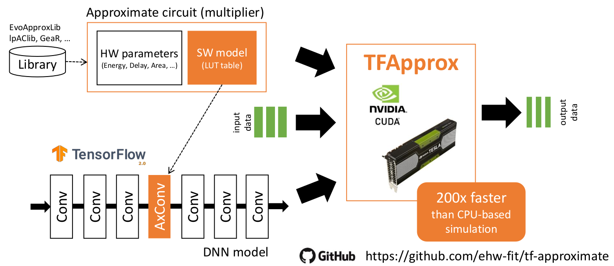

# TensorFlow Approximate Layers for GPUs

## Overview
This library extends TensorFlow library by **ApproxConv2DWithMinMaxVars** layer that implements **Conv2D** with approximate multiplier. The layer is intended to be used together with **FakeQuantWithMinMaxVars** layers (on inputs) to experiment with approximate/quantized convolutions in FP32 CNNs.

Although the TF layer **ApproxConv2DWithMinMaxVars** can be used directly we also provide Keras wrapper of the layer. The Keras wrapper **FakeApproxConv2D** ([python/keras/layers/fake_approx_convolutional.py](python/keras/layers/fake_approx_convolutional.py)) includes **FakeQuantWithMinMaxVars** to quantize the inputs. Both input and filter ranges (used for quantization) are computed for each batch independently.



## Pre-build singularity container
You can use a [Singularity](https://singularity.lbl.gov/) container (for installation Debian/Ubuntu systems run `sudo apt install singularity-container` command).

As a first step download the container
   
    singularity pull https://ehw.fit.vutbr.cz/tf-approximate/tf-approximate-gpu.sif
    
Then, you can run the container on your machine. We recommend to use *-H* command to override the Python packages you may have installed in your $HOME folder and *--bind* parameter to bind the folder you are working in.


    singularity shell -H $(pwd) --nv --bind . ../../tf-approximate-gpu.sif
    
This command swith you to the container (the command line should starts with `Singularity> ` prefix). You can run two short tests

```bash
python -c "import tensorflow as tf; print(tf.__version__)"
# Response: 2.1.0
python /opt/tf-approximate-gpu/test/test_table_approx_conv_2d.py
# Response: Linf Error: 3.072154584060627e-07 (or different negligible number)
```

Your container is prepared and you are able to run your own script inside it.


## Example: Approximation of accurate neural network
An example provided in [examples](examples) shows usage of Keras layer **FakeApproxConv2D**, which allows to simulate convolution using approximate 8x8 bit multiplier defined as arbitrary binary table.

The first step is to train the network defined using Keras layer (with accurate FP32 operations) as usual and store resulting weights to the file `lenet5_weights`:

```bash
python examples/fake_approx_train.py
```

In the accurate model, the neural network has a following structure
```python
model = tf.keras.Sequential([
    tf.keras.layers.Conv2D(filters=6, kernel_size=(3, 3), activation='relu'),
    tf.keras.layers.AveragePooling2D(),
    tf.keras.layers.Conv2D(filters=16, kernel_size=(3, 3), activation='relu'),
    tf.keras.layers.Flatten(),
    tf.keras.layers.Dense(120, activation='relu'),
    tf.keras.layers.Dense(84, activation='relu'),
    tf.keras.layers.Dense(10, activation='softmax')
])
```

For the approximate version, you can simply replace `Conv2D` operations by the poposed `FakeApproxConv2D` that performs a *fake quantization* and multiplication using operation defined by a binary lookup table in [binary files](examples/axmul_8x8). The included multipliers come from [EvoApprox](https://github.com/ehw-fit/evoapproxlib) library, however arbitrary approximate multipliers may be used.

```python
approx_model = tf.keras.Sequential([
    FakeApproxConv2D(filters=6, kernel_size=(3, 3), activation='relu', mul_map_file=args.mtab_file),
    tf.keras.layers.AveragePooling2D(),
    FakeApproxConv2D(filters=16, kernel_size=(3, 3), activation='relu', mul_map_file=args.mtab_file),
    tf.keras.layers.Flatten(),
    tf.keras.layers.Dense(120, activation='relu'),
    tf.keras.layers.Dense(84, activation='relu'),
    tf.keras.layers.Dense(10, activation='softmax')
])
```
After the construction of the approximate neural network, the weights from the accurate neural network are loaded back 
```python
approx_model.load_weights('lenet5_weights')
```

A script with approximating neural network trained by [examples/fake_approx_train.py](examples/fake_approx_train.py) script is provided in [examples/fake_approx_eval.py](examples/fake_approx_eval.py) with a following usage.

```bash
python examples/fake_approx_eval.py --mtab_file examples/axmul_8x8/mul8u_L40.bin
```
Leaving the argument "mtab_file" (multiplication table file) out will cause **FakeApproxConv2D** layers to use accurate 8x8 bit multiplication.


## Building from source
The library is implemented as dynamically loaded plugin for TensorFlow. The library can be either downloaded as CUDA enabled Singularity container [tf-approximate-gpu.sif](https://ehw.fit.vutbr.cz/tf-approximate/tf-approximate-gpu.sif) based on "tensorflow/tensorflow:latest-gpu-py3" image or built from sources

```bash
mkdir build
cd build
cmake ..
make
```

The prerequisites to build the library is working installation of CUDA SDK (10.0+) and TensorFlow (2.1.0+) with GPU (CUDA) support enabled. The build system provides switch to disable CUDA support, which causes the layer to fallback to **SLOW** CPU implementation: `cmake -DTFAPPROX_ALLOW_GPU_CONV=OFF ..`

Finally built library can be used as
```python
import tensorflow as tf
approx_op_module = tf.load_op_library('libApproxGPUOpsTF.so')
```


